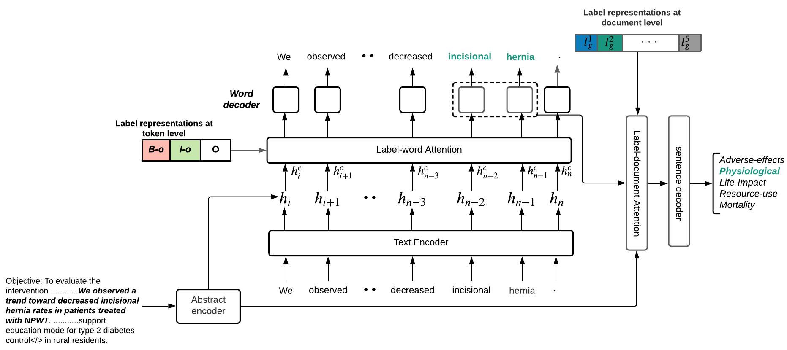

# LCAM

Jointly detecting and classifying outcomes within biomedical text records. Experiments and results of training this model
can be found in this [paper](https://arxiv.org/pdf/2104.07789.pdf).



LCAM simulataneously extracts outcomes (Outcome span detection (OSD)) and classifies them (Outcome Classification (OC)) given an input sentence, e.g.
> There was no significance between group differences in the incidence of **wheezing** or **shortness of breath**.
> 
> OSD detects abd extracts the outcomes ''Wheezing'' and ''shortness of breath'', and OC classifies them as ''Physiological outcomes''.

<!-- > <table>
  <tr>
    <th>OSD</th>
    <th>OC</th>
  </tr>
  <tr>
    <td>Wheezing</td>
    <td>Physiological</td>
  </tr>
  <tr>
    <td>Shortness of breath</td>
    <td>Physiological</td>
  </tr>
 > </table> -->

## Data
Download processed versions of datasets EBM-COMET and EBM-NLP from [here](https://drive.google.com/file/d/1J5PXFVk48uzcrNnrS7mufEdJppCQaisN/view?usp=sharing)

**Label document alignment (L-D-A)**

Part of this work is introducing a re-usable unsupervised text-alignment approach that extracts parallel annotations from comparable datasets.
LDA implementation [here](https://github.com/MichealAbaho/Label-document-Alignment). We leverage L-D-A to merge the two datasets above and evaluate LCAM on EBM-COMET+EBM-NLP. Preprocessed version of this dataset is downloadable [here](https://drive.google.com/file/d/1JA7-2yl0UA4t2KkFEAfY5QMqoe62gi-Q/view?usp=sharing).

## Train
Using **BiLSTM** as a Text encoder
```
python train.py --data multi-labelled-data/ebm_comet/lcam --vocabularly multi-labelled-data/lcam_vocabularly/ --abs_encoder --attention
(--attention for the attention layers and --abs_encoder for incoproating abstract representation)
```

Using **BioBERT** as a Text encoder
```
python train_transformer.py --data multi-labelled-data/ebm_comet/lcam --vocabularly multi-labelled-data/lcam_vocabularly/ --transformer ../pretrained_transformer_models/biobert/ --layer -1
```

## Citation
```
@article{abaho2021detect,
  title={Detect and Classify--Joint Span Detection and Classification for Health Outcomes},
  author={Abaho, Michael and Bollegala, Danushka and Williamson, Paula and Dodd, Susanna},
  journal={arXiv preprint arXiv:2104.07789},
  year={2021}
}
